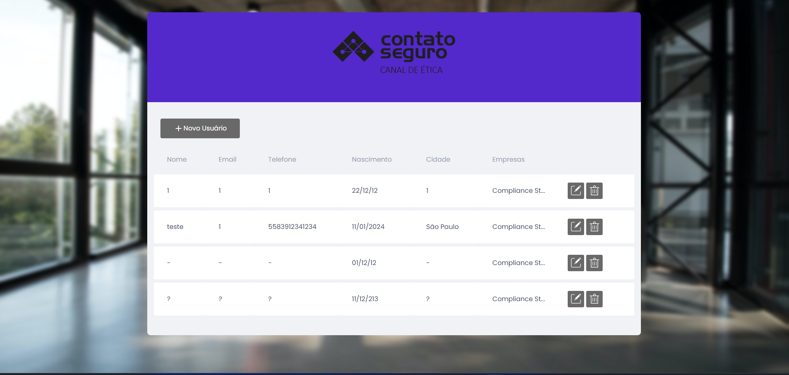
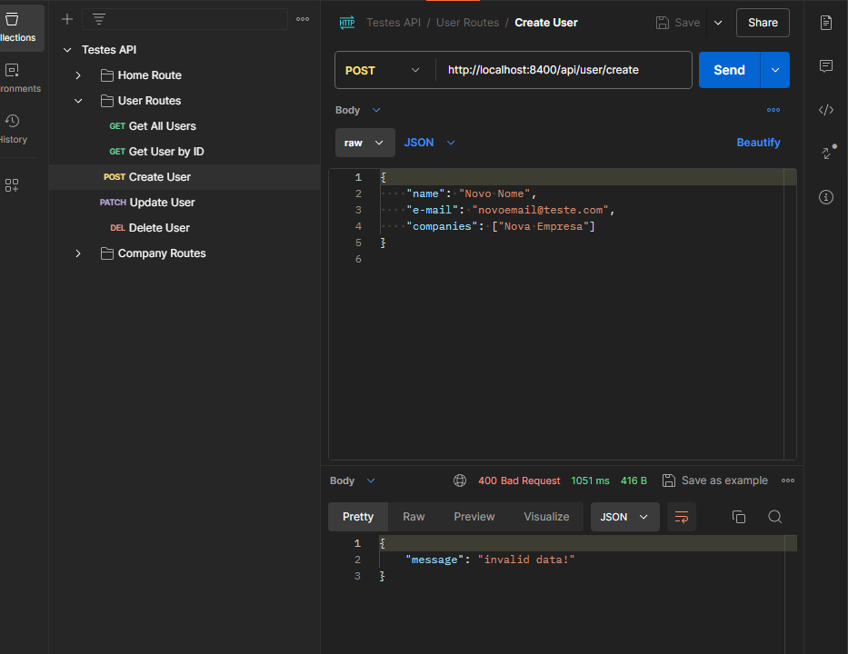

# Processo Seletivo - Analista de Testes JR


**Autor: Arthur Leal**

## Índice

1. [Descrição](#1-descrição)
2. [Configuração de ambiente](#2-configuração-de-ambiente)
3. [Testes em BDD com Gherkin](#3-testes-em-bdd-com-gherkin)
    1. [Testes de API](#31-testes-de-api)
    2. [Testes de Interface](#32-testes-de-interface)
4. [Melhorias sugeridas](#4-melhorias-sugeridas)
5. [Bugs encontrados](#5-bugs-encontrados)
    1. [5.1. BUG_001 - Exclusão de usuário não funcionando](#51-bug_001---exclusão-de-usuário-não-funcionando)
    2. [5.2. BUG_002 - Botão de editar não tem funcionalidade](#52-bug_002---botão-de-editar-não-tem-funcionalidade)
    3. [5.3. BUG_003 - Tabela não responsiva com dados grandes](#53-bug_003---tabela-não-responsiva-com-dados-grandes)
    4. [5.4. BUG_004 - O campo "Email" do cadastro de novo usuário aceita qualquer valor não nulo de entrada](#54-bug_004---o-campo-email-do-cadastro-de-novo-usuário-aceita-qualquer-valor-não-nulo-de-entrada)
    5. [5.5. BUG_005 - O campo "Nome" do cadastro de novo usuário aceita qualquer valor não nulo de entrada](#55-bug_005---o-campo-nome-do-cadastro-de-novo-usuário-aceita-qualquer-valor-não-nulo-de-entrada)
    6. [5.6. BUG_006 - O campo "Telefone" do cadastro de novo usuário aceita qualquer valor não nulo de entrada](#56-bug_006---o-campo-telefone-do-cadastro-de-novo-usuário-aceita-qualquer-valor-não-nulo-de-entrada)
    7. [5.7. BUG_007 - O campo "Cidade de Nascimento" do cadastro de novo usuário aceita qualquer valor não nulo de entrada](#57-bug_007---o-campo-cidade-de-nascimento-do-cadastro-de-novo-usuário-aceita-qualquer-valor-não-nulo-de-entrada)
   8. [5.8. BUG_008 - O campo de data do cadastro de novo usuário aceita valores não reais](#58-bug_008---o-campo-de-data-do-cadastro-de-novo-usuário-aceita-valores-não-reais)
   9. [5.9. BUG_009 - Erro ao criar usuário no end point “/api/user/create”](#59-bug_009---erro-ao-criar-usuário-no-end-point-apiusercreate)
   
6. [Testes automatizados](#6-testes-automatizados)
7. [Testes de API com Postman](#7-testes-de-api-com-postman)

## 1. Descrição


Este documento tem como objetivo mostrar as habilidades e conhecimentos na área de QA.

Durante todo o texto, será possível identificar todo o percurso do projeto, além de todos os testes e configurações.

O documento apresenta as seguintes partes para a avaliação:

- Identificação e descrição de bugs
- Sinalização de melhorias
- Criação de casos de teste
- Testes automatizados

## 2. Configuração de ambiente


É necessário a instalação do Docker na máquina.

Preferencialmente, utilize alguma distribuição Linux para a configuração do ambiente e realização dos testes.

Para iniciar o projeto, descompacte o projeto enviado por e-mail e acesse a pasta raiz do projeto via terminal.

Dentro da pasta raiz do projeto você deve rodar o seguinte comando:`docker-compose up --build -d`


Após o comando ser rodado, você poderá acessar a aplicação pela URL: `http://localhost:5400`.

Outros endpoints que serão expostos ao subir o projeto:

- Banco de dados (MySQL): `port 3400`
- Backend (PHP): `port 8400`

O projeto pode demorar para ser inicializado.

Após executar pela primeira vez o comando acima, pode-se subir o ambiente local pelo seguinte comando: `docker-compose up -d`


Para a execução dos testes automatizados, execute `npx cypress open` para ter uma visualização mais abrangente ou `npx cypress run` para uma execução mais direta.

Para os testes de API, será necessário importar o arquivo no programa Postman. O arquivo de importação pode ser encontrado no diretório `tests_docs/api/Testes API.postman_collection.json`.

Os textos, documentos e mídia podem ser encontrados na pasta `tests_docs`.

Isso organiza o texto em seções e formatação adequada para ser lido como um documento Markdown.

## 3. Testes em BDD com Gherkin

### 3.1. Testes de API
```gherkin
# language: pt
Funcionalidade: Home Route
  Cenário: Status code is 200
    Dado eu faço uma requisição GET para "/"
    Então o código de resposta deve ser 200

  Cenário: Response body is correct
    Dado eu faço uma requisição GET para "/"
    Então o corpo da resposta deve ser um JSON:
            """
           {"msg": "home"}
            """

  Cenário: Status code is 405
    Dado eu faço uma requisição POST para "/"
    Então o código de resposta deve ser 405

  Cenário: Response time is less than 200ms
    Dado eu faço uma requisição GET para "/"
    Então o tempo de resposta deve ser menor que 200ms


Funcionalidade: Obter Todos os Usuários

  Cenário: Verificar requisição GET para obter todos os usuários
    Dado que eu realizo uma requisição GET para "/api/user"
    Quando o código de resposta for 200
    Então a resposta deve ser uma lista de usuários

  Cenário: Validar estrutura dos elementos da lista de usuários
    Dado que eu realizo uma requisição GET para "/api/user"
    Quando o código de resposta for 200
    Então a resposta deve ser uma lista de usuários
    E cada usuário na lista deve conter os seguintes campos:
      | id_user     |
      | name        |
      | email       |
      | telephone   |
      | birth_date  |
      | birth_city  |
      | show        |
      | companies   |

  Cenário: Verificar código de resposta 400
    Dado que eu realizo uma requisição GET para "/api/user"
    Quando o código de resposta for 400
    Então o código de resposta deve ser 400

  Cenário: Verificar código de resposta 404
    Dado que eu realizo uma requisição GET para "/api/user"
    Quando o código de resposta for 404
    Então o código de resposta deve ser 404

Funcionalidade: Obter Usuário por ID

  Cenário: Obter usuário por ID existente
    Dado que eu realizo uma requisição GET para "/api/user/{id}"
    E o ID do usuário é existente
    Quando o código de resposta for 200
    Então a resposta deve conter os dados do usuário
    E a resposta deve ser JSON
    E a resposta deve conter os campos:
      | id_user     |
      | name        |
      | email       |
      | telephone   |
      | birth_date  |
      | birth_city  |
      | show        |
      | companies   |

  Cenário: Verificar requisição com ID de usuário inexistente
    Dado que eu realizo uma requisição GET para "/api/user/{id}"
    E o ID do usuário não existe
    Quando o código de resposta for 400
    Então o código de resposta deve ser 400

  Cenário: Verificar erro interno do servidor ao obter usuário por ID
    Dado que eu realizo uma requisição GET para "/api/user/{id}"
    E ocorre um erro interno do servidor
    Quando o código de resposta for 500
    Então o código de resposta deve ser 500

Funcionalidade: Criar Usuário

  Cenário: Criar usuário com dados válidos
    Dado que eu realizo uma requisição POST para "/api/user/create"
    E o corpo da requisição contém:
      """
      {
          "name": "Teste",
          "e-mail": "teste@teste.com",
          "companies": ["Empresa A"]
      }
      """
    Quando o código de resposta for 201
    Então a resposta deve conter os dados do usuário
    E a resposta deve ser JSON
    E a propriedade "name" deve ser "Teste"
    E a propriedade "email" deve ser "teste@teste.com"
    E a propriedade "companies" deve ser uma lista contendo "Empresa A"

  Cenário: Verificar requisição com dados inválidos
    Dado que eu realizo uma requisição POST para "/api/user/create"
    E o corpo da requisição contém dados inválidos
    Quando o código de resposta for 400
    Então o código de resposta deve ser 400

  Cenário: Verificar erro interno do servidor ao criar usuário
    Dado que eu realizo uma requisição POST para "/api/user/create"
    E ocorre um erro interno do servidor
    Quando o código de resposta for 500
    Então o código de resposta deve ser 500

Funcionalidade: Atualizar Usuário

  Cenário: Atualizar usuário com dados válidos
    Dado que eu realizo uma requisição PATCH para "/api/user/{id}/update"
    E o corpo da requisição contém:
      """
      {
          "name": "Novo Nome",
          "e-mail": "novoemail@teste.com",
          "companies": ["Nova Empresa"]
      }
      """
    Quando o código de resposta for 200
    Então a resposta deve conter os dados do usuário atualizados
    E a resposta deve ser JSON
    E a propriedade "name" deve ser "Novo Nome"
    E a propriedade "email" deve ser "novoemail@teste.com"
    E a propriedade "companies" deve ser uma lista contendo "Nova Empresa"

  Cenário: Verificar requisição com dados inválidos
    Dado que eu realizo uma requisição PATCH para "/api/user/{id}/update"
    E o corpo da requisição contém dados inválidos
    Quando o código de resposta for 400
    Então o código de resposta deve ser 400

  Cenário: Verificar erro interno do servidor ao atualizar usuário
    Dado que eu realizo uma requisição PATCH para "/api/user/{id}/update"
    E ocorre um erro interno do servidor
    Quando o código de resposta for 500
    Então o código de resposta deve ser 500

Funcionalidade: Deletar Usuário

  Cenário: Deletar usuário com ID existente
    Dado que eu realizo uma requisição DELETE para "/api/user/{id}/delete"
    Quando o código de resposta for 200
    Então a resposta deve conter a confirmação de deleção
    E a resposta deve incluir o texto "Usuário deletado com sucesso"

  Cenário: Verificar requisição com ID de usuário inexistente
    Dado que eu realizo uma requisição DELETE para "/api/user/{id}/delete"
    Quando o código de resposta for 400
    Então o código de resposta deve ser 400

  Cenário: Verificar erro interno do servidor ao deletar usuário
    Dado que eu realizo uma requisição DELETE para "/api/user/{id}/delete"
    Quando o código de resposta for 500
    Então o código de resposta deve ser 500

Funcionalidade: Obter Todas as Empresas

  Cenário: Obter lista de todas as empresas
    Dado que eu realizo uma requisição GET para "/api/company"
    Quando o código de resposta for 200
    Então a resposta deve ser uma lista de empresas

  Cenário: Verificar resposta vazia quando não há empresas retornadas
    Dado que eu realizo uma requisição GET para "/api/company"
    Quando o código de resposta for 200
    Então a resposta deve ser uma lista vazia

  Cenário: Verificar erro interno do servidor ao obter todas as empresas
    Dado que eu realizo uma requisição GET para "/api/company"
    Quando o código de resposta for 500
    Então o código de resposta deve ser 500

  Cenário: Verificar estrutura da resposta das empresas
    Dado que eu realizo uma requisição GET para "/api/company"
    Quando o código de resposta for 200
    Então a resposta deve conter uma estrutura correta para cada empresa na lista
    E cada empresa deve conter um "id_company" do tipo string
    E cada empresa deve conter um "name" do tipo string
    E cada empresa deve conter um "cnpj" do tipo string
    E cada empresa deve conter um "show" do tipo string
    E cada empresa deve conter um "id_adress" do tipo string
    E cada empresa deve conter um "cep" do tipo string
    E cada empresa deve conter um "country" do tipo string
    E cada empresa deve conter um "state" do tipo string
    E cada empresa deve conter um "city" do tipo string
    E cada empresa deve conter um "street" do tipo string
    E cada empresa deve conter um "number" do tipo string
    E cada empresa deve conter um "district" do tipo string
    E cada empresa pode conter um "additional", que pode ser uma string ou null
    E cada empresa pode conter um "users", que pode ser uma string ou null


Funcionalidade: Obter Empresa por ID

  Cenário: Obter empresa por ID existente
    Dado que eu realizo uma requisição GET para "/api/company/{id}"
    Quando o código de resposta for 200
    Então a resposta deve ser JSON
    E a resposta deve conter uma estrutura correta para a empresa
      | Propriedade    | Tipo    |
      | id_company     | string  |
      | name           | string  |
      | cnpj           | string  |
      | show           | string  |
      | id_adress      | string  |
      | cep            | string  |
      | country        | string  |
      | state          | string  |
      | city           | string  |
      | street         | string  |
      | number         | string  |
      | district       | string  |
      | additional     | string ou null |
      | users          | string ou null |

  Cenário: Verificar requisição com ID de empresa inexistente
    Dado que eu realizo uma requisição GET para "/api/company/{id}"
    Quando o código de resposta for 400
    Então o código de resposta deve ser 400

  Cenário: Verificar erro interno do servidor ao obter empresa por ID
    Dado que eu realizo uma requisição GET para "/api/company/{id}"
    Quando o código de resposta for 500
    Então o código de resposta deve ser 500

Funcionalidade: Criar Empresa

  Cenário: Criar empresa com dados válidos
    Dado que eu realizo uma requisição POST para "/api/company/create"
    E o corpo da requisição contém:
      """
      {
          "name": "Empresa Teste",
          "cnpj": "12345678000195",
          "adress": {
              "cep": "12345-678",
              "country": "Brasil",
              "city": "São Paulo",
              "street_location": "Rua Teste",
              "number": "123",
              "district": "Centro"
          }
      }
      """
    Quando o código de resposta for 201
    Então a resposta deve ser JSON
    E a resposta deve conter uma estrutura correta para a empresa
      | Propriedade        | Tipo    |
      | id_company         | string  |
      | name               | string  |
      | cnpj               | string  |
      | adress             | object  |
      | cep                | string  |
      | country            | string  |
      | city               | string  |
      | street_location    | string  |
      | number             | string  |
      | district           | string  |

  Cenário: Verificar requisição com dados inválidos
    Dado que eu realizo uma requisição POST para "/api/company/create"
    E o corpo da requisição contém dados inválidos
    Quando o código de resposta for 400
    Então o código de resposta deve ser 400

  Cenário: Verificar erro interno do servidor ao criar empresa
    Dado que eu realizo uma requisição POST para "/api/company/create"
    E ocorre um erro interno do servidor
    Quando o código de resposta for 500
    Então o código de resposta deve ser 500

Funcionalidade: Atualizar Empresa

  Cenário: Atualizar empresa com dados válidos
    Dado que eu realizo uma requisição PATCH para "/api/company/{id}/update"
    E o ID da empresa é "{id}"
    E o corpo da requisição contém:
      """
      {
          "name": "Nova Empresa",
          "cnpj": "98765432000199",
          "adress": {
              "cep": "54321-876",
              "country": "Brasil",
              "state": "São Paulo",
              "city": "São Paulo",
              "street": "Nova Rua",
              "number": "456",
              "district": "Centro"
          }
      }
      """
    Quando o código de resposta for 200
    Então a resposta deve ser JSON
    E a resposta deve conter uma estrutura correta para a empresa
      | Propriedade        | Tipo    |
      | id_company         | string  |
      | name               | string  |
      | cnpj               | string  |
      | adress             | object  |
      | cep                | string  |
      | country            | string  |
      | state              | string  |
      | city               | string  |
      | street             | string  |
      | number             | string  |
      | district           | string  |

  Cenário: Verificar requisição com dados inválidos
    Dado que eu realizo uma requisição PATCH para "/api/company/{id}/update"
    E o ID da empresa é "{id}"
    E o corpo da requisição contém dados inválidos
    Quando o código de resposta for 400
    Então o código de resposta deve ser 400

  Cenário: Verificar erro interno do servidor ao atualizar empresa
    Dado que eu realizo uma requisição PATCH para "/api/company/{id}/update"
    E o ID da empresa é "{id}"
    E ocorre um erro interno do servidor
    Quando o código de resposta for 500
    Então o código de resposta deve ser 500
```

### 3.2. Testes de Interface
```gherkin
Feature: Botão de adicionar novo usuário

  Scenario: Verificar se o botão de adicionar novo usuário está visível
    Given estou na página "http://localhost:5400/"
    When vejo a tela de listagem de usuários
    Then o botão "+ Novo Usuário" deve estar visível na tela

  Scenario: Verificar se o botão de adicionar novo usuário está funcionando
    Given estou na página "http://localhost:5400/"
    When vejo a tela de listagem de usuários
    And realizo um click no botão "+ Novo Usuário"
    Then vejo um modal com o titulo "Cadastrar novo usuário"


Feature: Botão de editar usuário

  Scenario: Verificar se o botão de editar usuário está visível
    Given estou na página "http://localhost:5400/"
    And tenho pelo menos um usuário cadastrado
    When acesso a tela de listagem de usuários
    Then o botão de edição deve estar visível na tela

  Scenario: Verificar se o botão de editar usuário está funcionando
    Given estou na página "http://localhost:5400/"
    And tenho pelo menos um usuário cadastrado
    When acesso a tela de listagem de usuários
    And realizo um click no botão de edição
    Then vejo um modal com o titulo "Editar usuário"

Feature: Botão de excluir usuário

  Scenario: Verificar se o botão de excluir usuário está visível
    Given estou na página "http://localhost:5400/"
    And tenho pelo menos um usuário cadastrado
    When acesso a tela de listagem de usuários
    Then o botão de exclusão deve estar visível na tela

  Scenario: Verificar se o botão de excluir usuário está funcionando
    Given estou na página "http://localhost:5400/"
    And tenho pelo menos um usuário cadastrado
    When acesso a tela de listagem de usuários
    And realizo um click no botão de exclusão
    Then vejo um modal com o titulo "Excluir usuário"


Feature: Cadastrar novo usuário

  Scenario: Cadastrar novo usuário com sucesso
    Given estou na página "http://localhost:5400/"
    When realizo um click no botão "+ Novo Usuário"
    And vejo o modal de cadastro
    And preencho os campos obrigatórios
    And realizo um click no botão "Salvar"
    Then vejo uma mensagem de sucesso
    And o novo usuário cadastrado na lista de usuários

  Scenario: Cadastrar novo usuário sem preencher os campos obrigatórios
    Given estou na página "http://localhost:5400/"
    When realizo um click no botão "+ Novo Usuário"
    And vejo o modal de cadastro
    And não preencho os campos obrigatórios
    And realizo um click no botão "Salvar"
    Then vejo uma mensagem de erro nos campos obrigatórios


  Scenario: Cadastrar novo usuário com email já cadastrado
    Given estou na página "http://localhost:5400/"
    When realizo um click no botão "+ Novo Usuário"
    And vejo o modal de cadastro
    And preencho os campos obrigatórios
    And preencho um email já cadastrado
    And realizo um click no botão "Salvar"
    Then vejo uma mensagem de erro de email já cadastrado
    And não consigo cadastrar o novo usuário


  Scenario: Cadastrar novo usuário com email inválido
    Given estou na página "http://localhost:5400/"
    When realizo um click no botão "+ Novo Usuário"
    And vejo o modal de cadastro
    And preencho os campos obrigatórios
    And preencho o campo "Email" com valor "emailinvalido"
    And realizo um click no botão "Salvar"
    Then vejo uma mensagem de erro de email inválido
    And não consigo cadastrar o novo usuário

  Scenario: Cadastrar novo usuário com nome em formato inválido
    Given estou na página "http://localhost:5400/"
    When realizo um click no botão "+ Novo Usuário"
    And vejo o modal de cadastro
    And preencho os campos obrigatórios
    And preencho o campo "Nome" com valor "123"
    And realizo um click no botão "Salvar"
    Then vejo uma mensagem de erro de nome inválido
    And não consigo cadastrar o novo usuário

  Scenario: Cadastrar novo usuário com telefone em formato inválido
    Given estou na página "http://localhost:5400/"
    When realizo um click no botão "+ Novo Usuário"
    And vejo o modal de cadastro
    And preencho os campos obrigatórios
    And preencho o campo "Telefone" com valor "teste"
    And realizo um click no botão "Salvar"
    Then vejo uma mensagem de erro de telefone inválido
    And não consigo cadastrar o novo usuário

  Scenario: Cadastrar novo usuário com data inválida
    Given estou na página "http://localhost:5400/"
    When realizo um click no botão "+ Novo Usuário"
    And vejo o modal de cadastro
    And preencho os campos obrigatórios
    And preencho o campo de data com valor "01/01/2022"
    And realizo um click no botão "Salvar"
    Then vejo uma mensagem de erro de data de nascimento inválida
    And não consigo cadastrar o novo usuário

  Scenario: Cadastrar novo usuário com cidade de nascimento inválida
    Given estou na página "http://localhost:5400/"
    When realizo um click no botão "+ Novo Usuário"
    And vejo o modal de cadastro
    And preencho os campos obrigatórios
    And preencho o campo "Cidade de Nascimento" com valor "123"
    And realizo um click no botão "Salvar"
    Then vejo uma mensagem de erro de cidade de nascimento inválida
    And não consigo cadastrar o novo usuário

  Scenario: Cadastrar novo usuário com empresa inexistente
    Given estou na página "http://localhost:5400/"
    When realizo um click no botão "+ Novo Usuário"
    And vejo o modal de cadastro
    And preencho os campos obrigatórios
    And preencho o campo "Empresa" com valor "Empresa Inexistente"
    And realizo um click no botão "Salvar"
    Then vejo uma mensagem de erro de empresa inexistente
    And não consigo cadastrar o novo usuário

  Scenario: Cadastrar novo usuário com data futura
    Given estou na página "http://localhost:5400/"
    When realizo um click no botão "+ Novo Usuário"
    And vejo o modal de cadastro
    And preencho os campos obrigatórios
    And preencho o campo de data com valor "01/01/2050"
    And realizo um click no botão "Salvar"
    Then vejo uma mensagem de erro de data de nascimento futura
    And não consigo cadastrar o novo usuário

  Scenario: Cadastrar novo usuário com data de nascimento muito antiga
    Given estou na página "http://localhost:5400/"
    When realizo um click no botão "+ Novo Usuário"
    And vejo o modal de cadastro
    And preencho os campos obrigatórios
    And preencho o campo de data com valor "01/01/0001"
    And realizo um click no botão "Salvar"
    Then vejo uma mensagem de erro de data de nascimento muito antiga
    And não consigo cadastrar o novo usuário

  Scenario: Cadastrar novo usuário com data de nascimento com mais que 4 digitos no ano
    Given estou na página "http://localhost:5400/"
    When realizo um click no botão "+ Novo Usuário"
    And vejo o modal de cadastro
    And preencho os campos obrigatórios
    And preencho o campo de data com valor "01/01/10000"
    And realizo um click no botão "Salvar"
    Then vejo uma mensagem de erro de data de nascimento inválida
    And não consigo cadastrar o novo usuário


Feature: Editar usuário

  Scenario: Editar usuário com sucesso
    Given estou na página "http://localhost:5400/"
    And tenho pelo menos um usuário cadastrado
    When acesso a tela de listagem de usuários
    And realizo um click no botão de edição
    And vejo o modal de edição
    And preencho os campos obrigatórios
    And realizo um click no botão "Salvar"
    Then vejo uma mensagem de sucesso
    And o usuário editado na lista de usuários


  Scenario: Editar usuário sem preencher os campos obrigatórios
    Given estou na página "http://localhost:5400/"
    And tenho pelo menos um usuário cadastrado
    When acesso a tela de listagem de usuários
    And realizo um click no botão de edição
    And vejo o modal de edição
    And não preencho os campos obrigatórios
    And realizo um click no botão "Salvar"
    Then vejo uma mensagem de erro nos campos obrigatórios
    And o usuário não é editado

  Scenario: Editar usuário com email inválido
    Given estou na página "http://localhost:5400/"
    And tenho pelo menos um usuário cadastrado
    When acesso a tela de listagem de usuários
    And realizo um click no botão de edição
    And vejo o modal de edição
    And preencho os campos obrigatórios
    And preencho o campo "Email" com valor "emailinvalido"
    And realizo um click no botão "Salvar"
    Then vejo uma mensagem de erro de email inválido
    And o usuário não é editado

  Scenario: Editar usuário com nome em formato inválido
    Given estou na página "http://localhost:5400/"
    And tenho pelo menos um usuário cadastrado
    When acesso a tela de listagem de usuários
    And realizo um click no botão de edição
    And vejo o modal de edição
    And preencho os campos obrigatórios
    And preencho o campo "Nome" com valor "123"
    And realizo um click no botão "Salvar"
    Then vejo uma mensagem de erro de nome inválido
    And o usuário não é editado

  Scenario: Editar usuário com telefone em formato inválido
    Given estou na página "http://localhost:5400/"
    And tenho pelo menos um usuário cadastrado
    When acesso a tela de listagem de usuários
    And realizo um click no botão de edição
    And vejo o modal de edição
    And preencho os campos obrigatórios
    And preencho o campo "Telefone" com valor "teste"
    And realizo um click no botão "Salvar"
    Then vejo uma mensagem de erro de telefone inválido
    And o usuário não é editado

  Scenario: Editar usuário com data inválida
    Given estou na página "http://localhost:5400/"
    And tenho pelo menos um usuário cadastrado
    When acesso a tela de listagem de usuários
    And realizo um click no botão de edição
    And vejo o modal de edição
    And preencho os campos obrigatórios
    And preencho o campo de data com valor "01/01/2022"
    And realizo um click no botão "Salvar"
    Then vejo uma mensagem de erro de data de nascimento inválida
    And o usuário não é editado

  Scenario: Editar usuário com cidade de nascimento inválida
    Given estou na página "http://localhost:5400/"
    And tenho pelo menos um usuário cadastrado
    When acesso a tela de listagem de usuários
    And realizo um click no botão de edição
    And vejo o modal de edição
    And preencho os campos obrigatórios
    And preencho o campo "Cidade de Nascimento" com valor "123"
    And realizo um click no botão "Salvar"
    Then vejo uma mensagem de erro de cidade de nascimento inválida
    And o usuário não é editado

  Scenario: Editar usuário com empresa inexistente
    Given estou na página "http://localhost:5400/"
    And tenho pelo menos um usuário cadastrado
    When acesso a tela de listagem de usuários
    And realizo um click no botão de edição
    And vejo o modal de edição
    And preencho os campos obrigatórios
    And preencho o campo "Empresa" com valor "Empresa Inexistente"
    And realizo um click no botão "Salvar"
    Then vejo uma mensagem de erro de empresa inexistente
    And o usuário não é editado

  Scenario: Editar usuário com data futura
    Given estou na página "http://localhost:5400/"
    And tenho pelo menos um usuário cadastrado
    When acesso a tela de listagem de usuários
    And realizo um click no botão de edição
    And vejo o modal de edição
    And preencho os campos obrigatórios
    And preencho o campo de data com valor "01/01/2050"
    And realizo um click no botão "Salvar"
    Then vejo uma mensagem de erro de data de nascimento futura
    And o usuário não é editado

  Scenario: Editar usuário com data de nascimento muito antiga
    Given estou na página "http://localhost:5400/"
    And tenho pelo menos um usuário cadastrado
    When acesso a tela de listagem de usuários
    And realizo um click no botão de edição
    And vejo o modal de edição
    And preencho os campos obrigatórios
    And preencho o campo de data com valor "01/01/0001"
    And realizo um click no botão "Salvar"
    Then vejo uma mensagem de erro de data de nascimento muito antiga
    And o usuário não é editado

  Scenario: Editar usuário com data de nascimento com mais que 4 digitos no ano
    Given estou na página "http://localhost:5400/"
    And tenho pelo menos um usuário cadastrado
    When acesso a tela de listagem de usuários
    And realizo um click no botão de edição
    And vejo o modal de edição
    And preencho os campos obrigatórios
    And preencho o campo de data com valor "01/01/10000"
    And realizo um click no botão "Salvar"
    Then vejo uma mensagem de erro de data de nascimento inválida
    And o usuário não é editado


Feature: Excluir usuário

  Scenario: Excluir usuário com sucesso
    Given estou na página "http://localhost:5400/"
    And tenho pelo menos um usuário cadastrado
    When acesso a tela de listagem de usuários
    And realizo um click no botão de exclusão
    And vejo o modal de exclusão
    And realizo um click no botão "Confirmar"
    Then vejo uma mensagem de sucesso

  Scenario: Excluir usuário com erro
    Given estou na página "http://localhost:5400/"
    And tenho pelo menos um usuário cadastrado
    When acesso a tela de listagem de usuários
    And realizo um click no botão de exclusão
    And vejo o modal de exclusão
    And realizo um click no botão "Cancelar"
    Then vejo uma mensagem de erro\
```


## 4. Melhorias sugeridas

* No front-end temos que fazer ajustes em alguns campos

* No campo "Email" deve ser aceito apenas emails como formato "username@domain.com", além disso, o campo tem obrigariedade de preenchimento.

* No campo "Telefone" deve apenas comportar números, deve comportar o formato padrão e obrigatoriamente deve ser preenchido. Ex: "+55 83 91823-2738".

* O campo "Cidade de nascimento" deve comportar apenas strings alfabéticas, apenas com letras e espaços. Se possível, ter um verificador de cidades, para apenas incluir cidades reais.

* O campo "Data de Nascimento" precisa de um limitador, colocando limitador considerando anos reais. Considerando um limitador de 120 anos a menos do ano atual, e limitando o ano para o ano atual.

* O campo "Empresas", pode compor a adição de empresas além das disponíveis, sendo um campo obrigatorio.

* Adicionar um limitador de entrada nos campos

* A vizualização da lista de usuarios se torna dificil quando temos nomes muito grande, tendo uma necessidade de quebra de linha nos elementos da tabela.

* Ao clicar no botão de excluir, poderia aparecer um modal para a confirmac`ção da exlcusao do usuário. Para evitar possiveis exlusões sem inteção.

* Adicionar função ao botão de editar o usuário escolhido.

* No banco de dados deve ser adicionado o "ON DELETE CASCADE" na chave estrangeira "id_user" na tabela "user_company". Para que quando seja solicitado uma exclusao, ela seja feita sem nenhum problema, já que ;o problema ocorre devido ao impedimento de exlucsao por esse motivo

* Filtros de ordenação na lista de usuários

* No modal de cadastro, o campo de data deve informar "Data de Nascimento" dentro do campo de entrada.

## 5. Bugs encontrados

* [Bugs encontrados](tests_docs/bugs.markdown)

### 5.1. BUG_001 - Exclusão de usuário não funcionando

O sistema mostra a exclusão na interface de usuário, porém, o usuário alvo continua salvo.

#### Requisitos

* Estar com o ambiente em funcionamento
* Ter ao menos um usuário cadastrado

#### Passos para reprodução

1. Entrar no link "http://localhost:5400/"
2. Clicar no simbolo de lixeira do primeiro elemento da tabela.
3. Aguardar a mensagem de "Sucesso".
4. Verificar na tabela que não foi realizada a exclusão.

#### Evidência


---

### 5.2. BUG_002 - Botão de editar não tem funcionalidade

Quando clicamos no botão de editar os dados do usuário nada acontece.

#### Requisitos

* Estar com o ambiente em funcionamento
* Ter ao menos um usuário cadastrado

#### Passos para reprodução

1. Entrar no link "http://localhost:5400/".
2. Clicar no simbolo de editar do primeiro elemento da tabela.
3. Esperar abrir o modal de edição

#### Evidência


### 5.3. BUG_003 - Tabela não responsiva com dados grandes

A tabela não apresenta quebra de linha nas suas linhas, o que prejudica a interface do usuário.
#### Requisitos

* Estar com o ambiente em funcionamento


#### Passos para reprodução

1. Entrar no link "http://localhost:5400/".
2. Clicar em "+ Novo Usuário".
3. Preencher o campo "Nome" com "testetestetestetestetestetestetestetestetestetestetestetestetestetestetestetestetestetestetestetestetestetestetesteteste".
4. Prencher o campo "Email" com "testetestetestetestetestetestetestetestetestetestetestetestetestetestetestetestetestetestetestetestetestetestetestetesteteste@teste.com".
5. Preencher o campo "Telefone" com "5583912341234".
6. Preencher o campo "Cidade de nascimento" com "testetestetestetestetestetestetestetestetestetestetestetestetestetestetestetestetestetestetestetestetestetestetesteteste".
7. Preencher o campo de data com 01/12/2024.
8. No campo de "Empresa" selecionar a primeira empresa disponivel.
9. Clicar em "Salvar".
10. Vizualizar a estrutura da tabela.

#### Evidência


### 5.4. BUG_004 - O campo "Email" do cadastro de novo usuário aceita qualquer valor não nulo de entrada

Quando criamos um novo usuário, o campo de entrada "Email" aceita qualquer entrada não nula e de formato diferente de um email.

#### Requisitos

* Estar com o ambiente em funcionamento


#### Passos para reprodução

1. Entrar no link "http://localhost:5400/".
2. Clicar em "+ Novo Usuário".
3. Preencher o campo "Nome" com "teste".
4. Prencher o campo "Email" com "1".
5. Preencher o campo "Telefone" com "5583912341234".
6. Preencher o campo "Cidade de nascimento" com "São Paulo".
7. Preencher o campo de data com 01/12/2024.
8. No campo de "Empresa" selecionar a primeira empresa disponivel.
9. Clicar em "Salvar".
10. Verificar que o usuário foi criado com sucesso.

#### Evidência


### 5.5. BUG_005 - O campo "Nome" do cadastro de novo usuário aceita qualquer valor não nulo de entrada

Quando criamos um novo usuário, o campo de entrada "Nome" aceita qualquer entrada não nula. O formato suporta qualquer caracter, seja alfabetico ou simbolo.

#### Requisitos

* Estar com o ambiente em funcionamento


#### Passos para reprodução

1. Entrar no link "http://localhost:5400/".
2. Clicar em "+ Novo Usuário".
3. Preencher o campo "Nome" com "? ".
4. Prencher o campo "Email" com "? ".
5. Preencher o campo "Telefone" com "? ".
6. Preencher o campo "Cidade de nascimento" com "? ".
7. Preencher o campo de data com 11/12/213.
8. No campo de "Empresa" selecionar a primeira empresa disponivel.
9. Clicar em "Salvar".
10. Verificar que o usuário foi criado com sucesso.

#### Evidência


### 5.6. BUG_006 - O campo "Telefone" do cadastro de novo usuário aceita qualquer valor não nulo de entrada

Quando criamos um novo usuário, o campo de entrada "Telefone" aceita qualquer entrada não nula. O formato suporta qualquer caracter, seja alfabetico ou simbolo.

#### Requisitos

* Estar com o ambiente em funcionamento


#### Passos para reprodução

1. Entrar no link "http://localhost:5400/".
2. Clicar em "+ Novo Usuário".
3. Preencher o campo "Nome" com "? ".
4. Prencher o campo "Email" com "? ".
5. Preencher o campo "Telefone" com "? ".
6. Preencher o campo "Cidade de nascimento" com "? ".
7. Preencher o campo de data com 11/12/213.
8. No campo de "Empresa" selecionar a primeira empresa disponivel.
9. Clicar em "Salvar".
10. Verificar que o usuário foi criado com sucesso.

#### Evidência


### 5.7. BUG_007 - O campo "Cidade de Nascimento" do cadastro de novo usuário aceita qualquer valor não nulo de entrada

Quando criamos um novo usuário, o campo de entrada "Cidade de Nascimento" aceita qualquer entrada não nula. O formato suporta qualquer caracter, seja alfabetico ou simbolo.

#### Requisitos

* Estar com o ambiente em funcionamento


#### Passos para reprodução

1. Entrar no link "http://localhost:5400/".
2. Clicar em "+ Novo Usuário".
3. Preencher o campo "Nome" com "? ".
4. Prencher o campo "Email" com "? ".
5. Preencher o campo "Telefone" com "? ".
6. Preencher o campo "Cidade de nascimento" com "? ".
7. Preencher o campo de data com 11/12/213.
8. No campo de "Empresa" selecionar a primeira empresa disponivel.
9. Clicar em "Salvar".
10. Verificar que o usuário foi criado com sucesso.

#### Evidência


### 5.8. BUG_008 - O campo de data do cadastro de novo usuário aceita valores não reais

Quando criamos um novo usuário, o campo de entrada de data aceita valores não reais.

#### Requisitos

* Estar com o ambiente em funcionamento


#### Passos para reprodução

1. Entrar no link "http://localhost:5400/".
2. Clicar em "+ Novo Usuário".
3. Preencher o campo "Nome" com "? ".
4. Prencher o campo "Email" com "? ".
5. Preencher o campo "Telefone" com "? ".
6. Preencher o campo "Cidade de nascimento" com "? ".
7. Preencher o campo de data com 11/12/213.
8. No campo de "Empresa" selecionar a primeira empresa disponivel.
9. Clicar em "Salvar".
10. Verificar que o usuário foi criado com sucesso.

#### Evidência


### 5.9. BUG_009 - Erro ao criar usuário no end point “/api/user/create”

Ao requisitar o endpoint “/api/user/create” utilizando o método POST. A requisição não suporta os dados mesmo utilizando exemplos padrões.

**Requisitos**

* Estar com o ambiente em funcionamento
* Utilizar o Postman para requisições

**Passos para reprodução**

1. Criar um novo request no Postman
2. Definir o método POST
3. Inserir a url “http://localhost:8400/api/user/create”
4. Passar o body
   {“name”: “Novo Nome”,
   “e-mail”: “novoemail@teste.com”,
   “companies”: [“Nova Empresa”]}
5. Enviar a requisição
6. Verificar o retorno obtido

#### Evidência


## 6. Testes automatizados

* [Testes automatizados](cypress/e2e/contato_seguro.cy.js)

## 7. Testes de API com Postman

Basta importar no Postman e executar os testes

* [Postman.json](tests_docs/api/Testes%20API.postman_collection.json)
